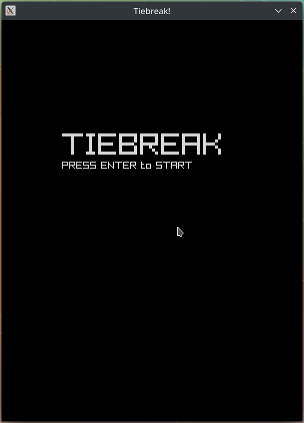

# Tiebreak

A tennis game in Common Lisp powered by [raylib][1] through [cffi][3].

## Install

1. Install [raylib][1]
2. Install [cffi][3]
1. Clone this repo
1. Load `:tiebreak`
1. Run `tiebreak:main`

## Build

```
make build
```

## Devlog

### 2022-02-14

Figured out how to project the ball trajectory to 2d perspective and happily
dropped the 3D perspective.  Introduced the first hitting target - static cones.



### 2022-02-10

Drop dependency on [cl-raylib][2] because I want to learn more about how `cffi`
works.  Thank you `cl-raylib` maintainers.

### 2022-02-02

Improved ball hitting physics.


### 2022-01-22

Rewrote the rendering from 2d to 3d for more realistic physics simulation.


### 2022-01-20

Start working on the physics.


### 2022-01-19


### 2022-01-16


### 2022-01-15


## License

MIT

[1]: https://www.raylib.com/
[2]: https://github.com/longlene/cl-raylib
[3]: https://github.com/cffi/cffi
